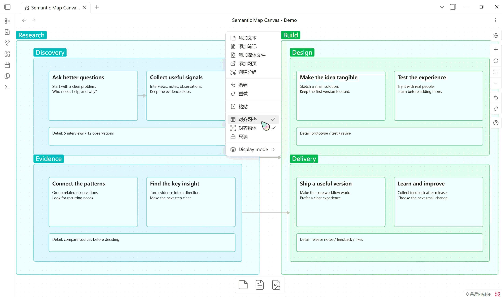

# Semantic Map Canvas

[English](README.md) | 简体中文

为 Obsidian 官方 Canvas 提供语义缩放。给普通节点和分组设置重要程度，缩小时便能从完整内容逐步切换到简洁标题和全局概览。

插件界面保持英文，项目说明提供中英双语。

当前正式发布版：**0.0.12**。需要桌面版 Obsidian **1.9.14 或更新版本**。移动端及广泛的主题、插件兼容性尚未验证。

## 效果演示

### 自动模式：缩小画布，保留重点

随着缩放，从详细笔记逐步切换到简洁标题和分组概览。



### 手动模式：固定缩放，切换视图

保持画布缩放不变，手动切换 Detail、Structure、Overview 和 Map 档位。


## 安装

1. 打开 [Releases](https://github.com/ryanleefm/semantic-map-canvas/releases)，选择要安装的版本，包括可用的 Pre-release 测试版。
2. 下载三个独立附件：**main.js**、**manifest.json** 和 **styles.css**。GitHub 自动生成的源码压缩包不是可直接安装的插件包。
3. 在你的 vault 中创建 `.obsidian/plugins/semantic-map-canvas/`，将三个文件放入其中。
4. 重启 Obsidian，在 **设置 → 第三方插件** 中启用 **Semantic Map Canvas**。

如果尚无 Release 附件，请按下方开发说明构建源码，再复制这三个文件。发布 GitHub Release 不会自动上架 Obsidian 社区插件市场。

## 使用

右键点击普通节点（文本、文件、链接）或分组，选择 **Semantic level**：

| 层级 | 含义 | 默认对象 |
| --- | --- | --- |
| L1 Domain | 领域：最宏观的主题 | |
| L2 Core | 核心内容 | 分组 |
| L3 Structure | 支撑结构 | 普通节点 |
| L4 Detail | 细节 | |

放大、缩小画布即可改变展示方式。移动节点或改变嵌套关系不会自动修改已分配的层级。

| 档位 | 普通节点 | 分组 |
| --- | --- | --- |
| DETAIL | L1–L4：原生完整内容 | 原生边缘标题 |
| STRUCTURE | L1–L3：简洁标题；L4：隐藏 | L1/L2：边缘标题；L3：可概括时显示中央标题；L4：隐藏 |
| OVERVIEW | L1/L2：简洁标题；L3/L4：隐藏 | L1：边缘标题；L2：可概括时显示中央标题；L3/L4：隐藏 |
| MAP | L1：简洁标题；L2–L4：隐藏 | L1：可概括时显示中央标题；L2–L4：隐藏 |

当内部仍有同等或更高优先级的可见节点、分组，或正在编辑的对象时，分组保留边缘标题。同为默认 L2 的嵌套分组，外层保留边缘标题，最内层符合条件的分组使用中央标题。隐藏分组不会自动隐藏其内部内容；连线任一端点隐藏时，连线也隐藏。

Auto 下最远显示档位由当前画布实际存在的最高层级决定：**L1 → MAP、L2 → OVERVIEW、L3 → STRUCTURE、L4 → DETAIL**。这样可避免仅因缺少更高层级而导致全空。实际 zoom 不受限制；极度缩小或平移离开内容仍可能看不清对象。

中央标题自动换行并缩小以适应节点。普通节点优先使用已有 shortLabel，否则使用文本首个非空行、文件名或网址主机名；分组使用名称。所有标题均为纯文本。长标题不截断、不限制行数，屏幕字号上限约 24px，极小区域需要放大阅读。目前尚无 shortLabel 编辑界面。

找不到隐藏节点时，可以切回 Auto 或 L4 — Detail；Auto 下也可放大。也可在命令面板执行 **Semantic Map Canvas: Toggle semantic visibility** 暂停显隐。暂停只在本次插件运行期间有效。关闭插件、切换活动 Canvas 或打开普通笔记时，会恢复先前画布的原生显示。只处理当前活动 Canvas。

### 自动与手动显示档位

在画布空白处右键，打开 **Display mode**：

- **Auto**（默认）：随缩放自动调整，保留滞回及最高层级限制。
- **L1 — Map**、**L2 — Overview**、**L3 — Structure**、**L4 — Detail**：固定显示档位，仍可自由缩放和平移。

手动选择不修改节点 Semantic level，也不受最高层级限制。没有 L1 节点时选择 L1 — Map 可能全部隐藏；从空白处右键切回 Auto 或 L4 — Detail 即可恢复。仅放大不会退出手动模式，中央标题仍随尺寸适配。

选择按 Canvas 保存在插件 data.json 中，重开与重命名后保留，旧数据默认 Auto。保存失败保留旧选择。暂停语义显隐时恢复原生内容但不重置选择，切回 Auto 时使用当前缩放。

画布设置菜单中也有此选项。插件仅扩展当前 Canvas 实例的内部菜单构建方法，切换或卸载时恢复；原生只读模式下若无空白右键菜单，可通过画布设置菜单操作。

## 数据与隐私

插件完全在本地运行，无网络请求或遥测。层级与可选 shortLabel 按 Canvas 路径和节点 ID 保存到插件的 `data.json`。显示变化不会重写 Canvas 文件中的节点位置、尺寸或内容。

重命名 Canvas 时迁移其元数据，删除 Canvas 时清理其记录；删除单个节点保留元数据以支持撤销。保存失败时保留之前的内存状态并提示。

旧 schema v1 数据迁移前先备份并验证，再转换到 schema v2：旧 L1 → L2、L2 → L3、L3 → L4，保留 shortLabel，不重复迁移。历史恢复步骤见 [Phase 7 报告](docs/phase7-validation.md)。

## 限制与兼容性

- 使用 Canvas 内部 API 和 DOM，可能随 Obsidian 版本变化。
- 原生选择操作仍可能包含视觉上隐藏的节点，批量编辑前可暂停显隐。
- 完整矩形包含才算嵌套；部分交叠不算包含，相同矩形的分组视为同级。不自动避让任意相交标题。
- 大型画布，尤其数千节点，在首次生成标题或几何变化时可能短暂停顿。
- 字号适配缓存测量结果，缩放复用排版；字体、标题或尺寸改变时重新计算。
- 节点尺寸预设和 shortLabel 编辑界面尚未实现。

初始档位阈值为 10%、25%、60%；运行时采用 9%/11%、23%/27%、58%/62% 的滞回区间，减少阈值附近闪烁。每 100ms 采样缩放，约每 300ms 检查几何、编辑及 DOM 变化。

欢迎用中文或英文在 [Issues](https://github.com/ryanleefm/semantic-map-canvas/issues) 反馈问题，请附插件与 Obsidian 版本、复现步骤，以及移除私密内容后的截图或最小样例。

## 开发

使用 Node.js 18+ 和 npm。

```sh
npm ci
npm run build
npm run lint
npm test
```

`npm run dev` 监听源码变化；`npm run benchmark` 运行模拟 DOM 性能基准；`npm run test:visual` 运行隔离 Chrome/Edge 排版检查。自动化测试不能代替真实 Obsidian 验收。

`npm run deploy:test` 构建并将三个插件文件复制到项目内的 `VaultsforTest/.obsidian/plugins/semantic-map-canvas/`，保留已有 `data.json`。测试 vault 和生成产物不纳入 Git。历史报告提到的分阶段测试画布是本地开发样例，克隆源码时不包含它们。

- `src/canvas/`：活动 Canvas、原生菜单、视口采样及兼容层。
- `src/semantic/`：语义层级、展示规则、包含关系、元数据和迁移。
- `src/rendering/`：显隐类、字号适配及清理。
- `tests/`：规则、存储、DOM 和生命周期回归测试。

历史开发和验证报告目前保留中文：[Phase 12](docs/phase12-validation.md)、[Phase 11](docs/phase11-validation.md)、[Phase 10 性能](docs/phase10-validation.md)、[Canvas runtime](docs/canvas-runtime.md)。

基于 [Obsidian sample plugin](https://github.com/obsidianmd/obsidian-sample-plugin)。采用 [MIT 许可证](LICENSE)。

[0.0.12 中英双语发布说明](docs/release-notes-0.0.12.md)

模板来源与原始许可声明：[第三方声明](THIRD_PARTY_NOTICES.md)。

[Phase 13 验收说明](docs/phase13-validation.md)
